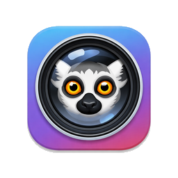

  

# LemurCam

**Ditch the USB. Keep the camera.**

LemurCam is a macOS app that turns any IP camera into a virtual webcam. Use your RTSP or ONVIF cameras directly in Zoom, Teams, OBS, and any other app that supports camera input.

**Website:** [lemur.cam](https://lemur.cam) · **[Download Latest Release](https://github.com/steelbrain/LemurCam/releases/latest)**

## Features

- Virtual camera device that works with any macOS app
- ONVIF camera auto-discovery on your local network
- Direct RTSP stream support
- Demand-driven streaming — only active when an app is using the camera
- Menu bar app with quick-access popover
- Siri Shortcuts integration

## Compatible Cameras

LemurCam works with any IP camera that supports RTSP or ONVIF. Some popular options:

- **TP-Link Tapo** (C100, C200, C210) — great starter cameras at $20–35
- **Reolink** (E1, RLC-510A, RLC-810A)
- **Hikvision** and **Dahua** series
- **Amcrest** (IP2M, IP5M)
- **UniFi Protect** cameras

If your camera has an RTSP URL or supports ONVIF discovery, it will work with LemurCam.

**Requires macOS 14.0 (Sonoma) or later.**

## Issue Tracker

This repository serves as the public issue tracker for LemurCam. If you've found a bug or have a feature request, please [open an issue](https://github.com/AneesIqbal/LemurCam/issues/new).

## Author

[Anees Iqbal](https://aneesiqbal.ai) ([@steelbrain](https://github.com/steelbrain))
